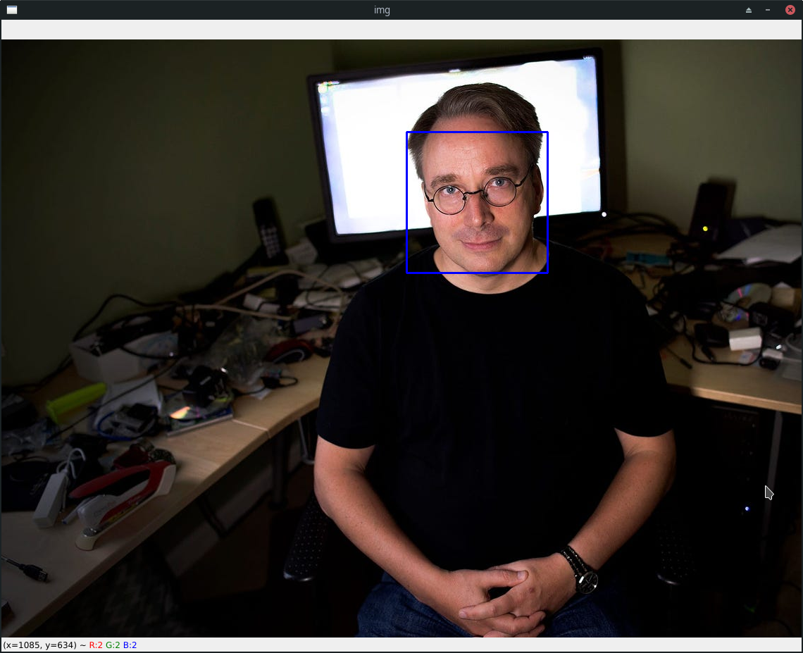

# Face Detection OpenCV (cv2)

**Tiny Python program to capture the image and video, and detect faces (in real time) powered by OpenCV.**

## Steps

- `image.py`: Detect faces inside a frame of image
- `video.py`: Detect faces inside a video file
- `webcam.py`: Detect faces from webcam real time

### Demo



## Using

```bash
$ python image.py
$ python video.py
$ python webcam.py
```

The `haarcascade_frontalface_default.xml` originally available on https://github.com/opencv/opencv/blob/master/data/haarcascades/haarcascade_frontalface_default.xml.
